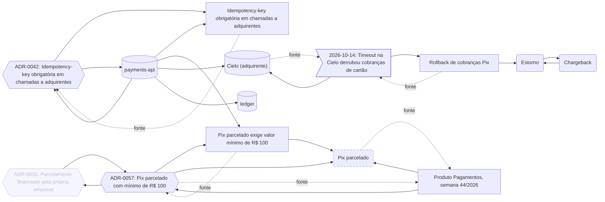

# Grafo · examples/payments

> Gerado por `tools/build_graph.py`. Não edite à mão. Seta cheia = link no texto · pontilhada = fonte · tracejado = não verificado · esmaecido = deprecated.

```mermaid
graph LR
  classDef unverified stroke-dasharray: 5 5
  classDef deprecated opacity:0.5
  n0{{"ADR-0031: Parcelamento financiado pela própria empresa"}}
  class n0 deprecated
  n1{{"ADR-0042: Idempotency-key obrigatória em chamadas a adquirentes"}}
  n2{{"ADR-0057: Pix parcelado com mínimo de R$ 100"}}
  n3>"2026-10-14: Timeout na Cielo derrubou cobranças de cartão"]
  n4["Produto Pagamentos, semana 44/2026"]
  n5["Idempotency-key obrigatória em chamadas a adquirentes"]
  n6["Pix parcelado exige valor mínimo de R$ 100"]
  n7["Rollback de cobranças Pix"]
  n8[("Cielo (adquirente)")]
  n9[("ledger")]
  n10[("payments-api")]
  n11("Chargeback")
  n12("Estorno")
  n13("Pix parcelado")
  class n13 unverified
  n0 --> n2
  n1 --> n5
  n1 --> n10
  n2 --> n0
  n2 --> n6
  n2 --> n13
  n2 -. fonte .-> n4
  n3 --> n7
  n3 --> n8
  n4 --> n2
  n4 --> n13
  n5 -. fonte .-> n1
  n6 --> n13
  n6 -. fonte .-> n2
  n7 --> n12
  n7 -. fonte .-> n3
  n8 -. fonte .-> n3
  n10 --> n1
  n10 --> n5
  n10 --> n6
  n10 --> n8
  n10 --> n9
  n11 --> n12
  n12 --> n11
  n13 -. fonte .-> n4
```
